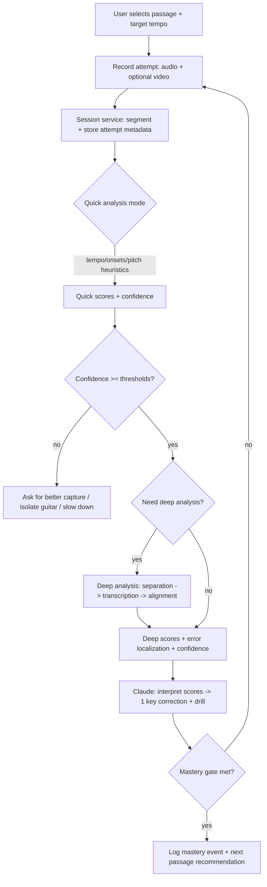

# Defining a North Star for Eurydice and Using It as the Product and Technical Backbone

## Executive summary

Eurydice’s core product promise should be **measurable, repeatable musical progress**, not “audio analysis” or “chat-based coaching.” A tight North Star outcome is what prevents the build from drifting into impressive-but-unhelpful features (pretty transcriptions, long explanations, generic practice advice). Guidance on North Star metrics emphasizes a single outcome that captures delivered customer value and becomes the organizing principle for prioritization.citeturn5search0turn5search15turn5search3

A practical constraint shapes the architecture: the public Claude API (from entity["company","Anthropic","ai research company"]) supports **text and image input**, and the Messages API is documented as accepting “text and/or image content.” Audio input is explicitly not supported in some compatibility contexts (and will be ignored/stripped).citeturn7search18turn7search9turn7search0 Therefore, Claude should be your **teaching/orchestration layer**, while **audio/vision tools produce the measurements** (pitches, onsets, chords, posture features) that Claude interprets into coaching.

Two research threads are particularly relevant to your “Guitar Hero but real” ambition:

- Feedback works when it is **informational and actionable** (not just scores or praise), and some forms of tech-mediated feedback can be beneficial when they help learners adjust strategies.citeturn6search4turn6search8  
- For “audio reasoning,” Chain-of-Thought-style prompting can help on easier tasks but may confuse models on harder tasks; one Audio-CoT study also reports a positive correlation between reasoning path length and accuracy (with latency/cost implications).citeturn20view0turn19view0 A separate survey notes large audio-language model evaluation is fragmented and proposes a taxonomy including **auditory processing, reasoning, dialogue ability, and safety/trust**—a useful structure for Eurydice’s evaluation program.citeturn15view0

Finally, licensing is a first-order technical risk: **Essentia is AGPLv3 for non-commercial use unless you obtain commercial licensing**, and **aubio is GPL-licensed and explicitly warns it is not MIT/BSD and prompts contacting the author for commercial products**.citeturn4search3turn4search12turn4search7 This must be decided early because it affects deployment architecture and business model feasibility.

## North Star and rationale

### Concise North Star statement

**North Star user outcome:**  
**A guitarist reliably masters a short passage they care about (10–30 seconds) to a defined standard (timing + note accuracy), and can repeat it on demand.**

“Mastery” here is not subjective—it is the system’s definition of “repeatable performance at target tempo with acceptable errors,” implemented as a **mastery gate** (details in Metrics and Architecture sections).

### Why this is the right North Star

A North Star should capture customer value and align teams around impact-driven roadmap decisions.citeturn5search0turn5search15turn5search3 In guitar learning, the value is not “minutes practiced” or “songs attempted,” but **consistent ability to play real musical material**.

Market expectations already include “the app listens and gives instant feedback,” as described by entity["company","Yousician","music education app company"] (“using your device’s built-in microphone… provides instant feedback”).citeturn11search5 Eurydice can differentiate not by becoming another scoring game, but by becoming a **measurement-driven teacher**: predict the 1–2 highest-leverage fixes, give a targeted drill, and prove mastery with repeatable passes.

## Personas and prioritized user journeys

Because target skill level, platform, and business model are open, the most robust default is: **beginner-to-intermediate first**, mobile-friendly capture and playback, and a business model that can evolve (freemium → subscription) only after mastery outcomes are demonstrably real.

### Proposed personas

**Starter (0–3 months):** struggles with chord transitions, rhythm stability, buzzing/muting. Needs simple capture, short drills, and very clear “what to do next.”

**Plateaued intermediate (6–24 months):** can play some songs but lacks consistency: late/early timing during shifts, messy string noise, bend intonation, syncopation. Needs precise error localization and progressive drills.

**Advanced / gigging player:** wants tight timing, dynamics, articulation, and fast troubleshooting. Will churn if feedback is wrong, vague, or slow.

### Prioritized journeys

**Passage mastery loop (top priority):**  
User selects a passage (from a recording, tab, or structured library), plays it, Eurydice scores it, diagnoses the top error, generates a micro-drill, and iterates until mastery.

**Technique troubleshooting (second priority):**  
User records a short clip and optionally a camera angle; Eurydice identifies likely technique issues and prescribes a drill (e.g., muting, wrist angle, pick depth).

image_group{"layout":"carousel","aspect_ratio":"16:9","query":["guitar left hand fretting technique close up","guitar right hand picking technique close up","guitar posture seated playing"],"num_per_query":1}

**Structured practice plan (third priority):**  
Personalized daily plan driven by measured weaknesses (timing, chord transitions, bends). This is retention-positive but only works once scoring/diagnosis is trustworthy.

## Mapping the North Star to measurable success metrics

This section defines what “mastered” means, and proposes targets for learning gains, retention, accuracy, and latency.

### North Star metric model

A scalable product metric that directly represents the North Star outcome:

**Weekly Mastery Events per Active User (WME/AU)**

A **Mastery Event** occurs when the user achieves **N consecutive passes** (e.g., 3) of the same passage meeting thresholds for timing and note correctness *and* meeting confidence requirements (to avoid “false mastery”).

This supports North Star discipline: shipping anything that doesn’t increase WME/AU is deprioritized.

### Learning and correctness metrics grounded in MIR conventions

For objective scoring, reuse established MIR evaluation conventions:

- `mir_eval` provides standardized evaluation for onset detection and transcription (precision/recall/F-measure, overlap variants).citeturn8search19turn8search0  
- A common onset tolerance is **±50 ms** in note-level onset evaluation contexts.citeturn8search8turn8search14turn8search18  
- For chord estimation, MIREX uses **weighted chord symbol recall (WCSR)** as a key measure.citeturn8search1turn8search20  
- Perceptual-validity research suggests onset-only notewise F-measure often correlates best with human judgment, especially with higher onset tolerance thresholds—useful when aligning “machine score” to “what sounds wrong.”citeturn8search2

### Latency targets

For the experience to feel coach-like:

- UI interactions should feel instantaneous (~0.1s) and preserve flow (~1s) per established response-time thresholds.citeturn5search1turn5search9  
- Feedback should be **two-speed**: fast heuristic feedback (timing drift, obvious wrong notes) quickly, and compute-heavy deep analysis (separation + transcription) with progress indicators.

### Proposed metric targets table

| Metric | Definition | Target (MVP) | Why it’s load-bearing |
|---|---|---:|---|
| WME/AU | mastered passages per active user per week | ≥ 1 for engaged users | Measures real progress (North Star) |
| Mastery gate | 3 passes meeting timing + note thresholds and confidence gate | defined below | Prevents “gamified illusion” |
| Timing score | beat-aligned deviation and/or onset F1 | ≥ 0.85 on target passage | Timing is the most salient error class for many learners |
| Note score | note-level precision/recall/F1 (onset-only or pitch+onset depending on task) | ≥ 0.80 | Objective correctness using common evaluation toolsciteturn8search0 |
| Confidence gate | minimum tool confidence (per task) | e.g., ≥ 0.7 | Avoid wrong high-confidence coaching (trust) |
| Feedback latency (quick) | phrase end → first feedback | P50 < 1.5s, P95 < 3s | Maintains flowciteturn5search1 |
| Feedback latency (deep) | phrase end → full transcription/separation | P50 < 8s, P95 < 20s | Must show progress for long opsciteturn5search1 |
| Week-4 retention | active at week 4 | product-dependent baseline | Retention validates ongoing value |

## Backbone architecture and tool contracts

### Backbone principles

1. **Mastery-loop first:** every session is a state machine that ends in a mastery gate or in an explicit “can’t score reliably” outcome with corrective capture instructions.
2. **Measurements with uncertainty:** audio/vision tools output confidence; Claude is not allowed to “smooth over” low confidence.
3. **Two-speed analysis:** cheap real-time-ish features first, heavy models second.
4. **Tool contracts are product contracts:** stable schemas enable evaluation, caching, and regression testing.

### Modules and data flow

- Client: capture audio + optional camera, show target, show score heatmaps and drills.
- Session service: authoritative session state, target definition, attempt boundaries, mastery status.
- Audio analysis service: feature extraction (tempo/onsets/pitch), transcription, optional separation.
- Vision analysis service: hand landmarks/technique flags (optional for MVP).
- Orchestration: Claude tool planning + pedagogy + explanation style.

Claude-specific constraints should be treated as architectural facts:

- Current Claude models support **text and image input**; Messages API is documented as accepting “text and/or image content.”citeturn7search18turn7search9  
- Tool use is the supported method for integrating deterministic computation.citeturn0search0turn0search3  
- If you need strict schemas, use Claude’s structured outputs guidance rather than assuming loose tool calling will always conform.citeturn7search27

### Tool contracts

You asked for three contracts: `audio_analysis`, `vision_analysis`, `orchestration`.

**Design recommendation:** treat `orchestration` as *Claude itself* (Messages API + tool use). Your internal “orchestration tool” should be a deterministic wrapper that (a) asks Claude for a plan in a constrained schema, (b) executes tool calls, and (c) asks Claude for a learner-facing response.

#### Audio analysis stack and what each tool is good for

Your proposed tool list is viable, but it needs a clear division of labor:

- **Essentia**: broad MIR feature toolbox (tonal, rhythm, descriptors) and ML model wrappers; documentation describes it as an extensive audio/MIR algorithm collection and includes tonal extractors.citeturn12search1turn12search30  
- **Basic Pitch** (from entity["company","Spotify","music streaming company"]): audio-to-MIDI transcription; supports polyphonic instruments and works best on one instrument at a time; includes multiple runtimes (TF/CoreML/TFLite/ONNX) for deployment.citeturn2view1turn3view3  
- **aubio**: onset/beat/pitch utilities and explicitly mentions producing MIDI streams from live audio; but licensing is GPL.citeturn1search0turn4search12  
- **Demucs** (from entity["company","Meta","facebook parent company"]): source separation; separates vocals/drums/bass/other; repo notes it is not maintained and is MIT-licensed.citeturn3view0turn2view0  
- **librosa**: core music/audio analysis building blocks (e.g., pYIN, pitch tracking, DTW synchronization utilities).citeturn1search1turn1search5turn4search25  
- **CREPE**: monophonic pitch tracking; repo states monophonic pitch tracker; MIT license.citeturn9view0turn9view1  

**Confidence propagation example:** Essentia’s `PitchCREPE` outputs a confidence value 0–1 per timestamp.citeturn12search2 This is exactly the shape you want to propagate forward into coaching decisions (“I’m not confident—ask for cleaner input / isolate guitar / slow down / remove backing track”).

#### Vision analysis choices

For MVP, prefer a well-supported general hand landmark tracker:

- MediaPipe Hands describes inferring 21 3D landmarks from a single frame and achieving real-time performance on mobile.citeturn13search0turn13search21  
- If you need classic CV utilities, OpenCV licensing is Apache 2.0 for OpenCV 4.5.0+ per OpenCV’s license page.citeturn13search1

### Example structured payloads

**Audio analysis response schema (illustrative)**

| Field | Type | Description |
|---|---|---|
| `tempo_bpm` | number | estimated BPM |
| `tempo_confidence` | 0–1 | confidence in BPM |
| `beat_times_s` | number[] | beat timestamps |
| `note_events` | object[] | `{onset_s, offset_s, midi, velocity?, confidence?}` |
| `pitch_track_hz` | number[] | monophonic F0 track when applicable |
| `pitch_confidence` | 0–1 array | voicing confidence per frame (if available) |
| `alignment` | object | DTW/alignment summary vs target |
| `performance_scores` | object | `{timing: 0–1, notes: 0–1, overall: 0–1}` |
| `warnings` | string[] | capture issues: clipping, noise, polyphony |

**Vision analysis response schema (illustrative)**

| Field | Type | Description |
|---|---|---|
| `hands_detected` | int | number of hands |
| `hand_landmarks` | object | 21-point landmarks per hand |
| `handedness` | string[] | left/right |
| `technique_flags` | object[] | `{flag, severity, confidence}` |
| `capture_warnings` | string[] | occlusion, low light |

### Mermaid flowchart of the backbone



### Failure modes you should explicitly design for

**Audio capture ambiguity:** backing track dominates; chord voicings create polyphony; reverb/distortion changes timbre; clip noise. (Mitigation: separation via Demucs; instrument isolation guidance; mode that expects “single instrument at a time,” consistent with Basic Pitch guidance.)citeturn2view1turn3view0

**Latency spikes:** separation and transcription cost is variable; must show progress and allow cancel, consistent with long-operation UX guidance.citeturn5search1

**Wrong confident coaching:** the worst failure mode. Must implement confidence gating and “ask for more data” behaviors, leveraging confidence outputs like those in Essentia’s PitchCREPE.citeturn12search2

## Claude’s role boundaries and what Audio-CoT implies for Eurydice

### How Claude fits

Claude should do:

- tool selection and sequencing (tool use)citeturn0search0turn0search3  
- pedagogical response generation (actionable correction + drill)  
- dialogue state and motivation (keep learner engaged without lying)

Claude should not do:

- raw audio ingestion (not supported as direct input)citeturn7search18turn7search9turn7search0  
- DSP/transcription internally (must be benchmarked and testable via MIR tools)  
- long “reasoning monologues” that mask uncertainty

### Why Audio-CoT matters, even if Eurydice is tool-based

The Audio-CoT paper identifies that applying CoT-style methods in large audio-language models can **improve performance on easy/medium tasks but can fail on hard tasks where longer reasoning chains confuse the model**; it also reports a **positive correlation between reasoning length and accuracy** and evaluates CoT methods on audio reasoning benchmarks like MMAU.citeturn19view0turn20view0

Implications for Eurydice:

- **Don’t equate longer reasoning with better teaching.** Long rationales can be wrong-but-persuasive; your product should optimize for *actionable feedback + verified scoring*, not verbosity.
- **Use “selective inference scaling.”** When confidence is high and latency budget allows, you can ask Claude for deeper diagnosis; when confidence is low or the task is “hard,” prefer data collection (“record isolated guitar,” “slow tempo,” “different mic position”) and tool re-runs.
- **Expose evidence, not chain-of-thought.** For trust, show measured artifacts: timing heatmaps, missed note timestamps, or posture flags—grounded in tool outputs.

### Using the LALM evaluation taxonomy as an internal evaluation frame

The LALM-Evaluation-Survey repo argues benchmarks are fragmented and proposes a taxonomy across four dimensions: **General Auditory Awareness and Processing, Knowledge and Reasoning, Dialogue-oriented Ability, and Fairness/Safety/Trustworthiness**.citeturn15view0

Even though Eurydice is not a single end-to-end audio language model, the taxonomy is still valuable:

- **Auditory processing:** does Eurydice correctly extract timing/pitch/chords under realistic noise?
- **Reasoning:** does it correctly infer the *cause* of errors and choose the right drill?
- **Dialogue ability:** does it keep the learner in a tight mastery loop without confusion?
- **Safety/trust:** does it avoid confident wrong feedback, over-practice injury suggestions, or misleading claims?

## MVP scope and milestone plan

Below is a milestone plan that keeps the North Star enforceable, avoids premature polish, and de-risks correctness.

### MVP definition

**MVP goal:** deliver the passage mastery loop for monophonic-ish guitar lines (single-note riffs/licks) before attempting full chord transcription.

Reason: polyphonic transcription and chord estimation are materially harder and less reliable; you want early wins in trust and learning outcomes.

### Suggested milestones and acceptance criteria

**Milestone A: Core mastery loop (weeks 0–3)**  
Scope:
- capture 10–30s phrase
- quick timing + pitch scoring
- one correction + one drill
Acceptance criteria:
- P50 feedback < 2s on “quick analysis”
- mastery gate functional
- confidence gating: low-confidence → asks for better capture instead of pretending

**Milestone B: Deep analysis integration (weeks 3–7)**  
Scope:
- integrate Basic Pitch transcription pipeline for note events (audio→MIDI)citeturn2view1turn3view3  
- optional separation via Demucs when backing track presentciteturn3view0turn2view0  
Acceptance criteria:
- deep analysis P50 < 8s on a reference machine
- measurable improvement loop: users’ timing/note scores improve across retries

**Milestone C: Vision-assisted technique flags (weeks 7–10)**  
Scope:
- add hand landmarks and 2–3 technique flags (e.g., collapsed wrist, excessive finger lift) using MediaPipe Handsciteturn13search0  
Acceptance criteria:
- flags are shown only above confidence threshold
- users report flags are understandable and actionable (qualitative test with instructors)

**Milestone D: Song-mode prototype (weeks 10–14)**  
Scope:
- align user performance to a reference (tab/MIDI or extracted guide path)
- segment into micro-passages automatically
Acceptance criteria:
- at least one full song section can be mastered via sub-passages
- no regression in false-mastery rate

## Evaluation plan and research experiments

### Offline evaluation for audio modules

Use public datasets with relevant ground truth:

- **GuitarSet** provides guitar recordings with rich annotations and was recorded using hexaphonic pickup signals to support note-level annotation.citeturn10search4turn10search0  
- **IDMT-SMT-Guitar** is described as a large database for automatic guitar transcription.citeturn10search1  

Offline metrics:
- note-level precision/recall/F1 (mir_eval transcription)citeturn8search0  
- onset-only F1 and alignment scores (also in mir_eval)citeturn8search3turn8search0  
- chord metrics (WCSR) for chord-focused features later (MIREX definition)citeturn8search1  

### Human-in-the-loop labeling

You will need teacher judgments for “did this feedback help?” because objective metrics don’t capture pedagogy quality.

Protocol:
- sample sessions with before/after attempts
- instructor labels: primary error type, best next drill, helpfulness score
- compare Eurydice’s chosen drill vs instructor drill (top-1 agreement, and “acceptable alternatives”)

This aligns with the research emphasis that feedback effectiveness depends on information content and strategy improvement, not just correctness labels.citeturn6search4turn6search8

### Online experiments and A/B tests

A/B test *teaching policies*, not just UI:

- **Single-issue vs multi-issue feedback:** does focusing on one correction improve mastery rate?
- **Heuristic-first vs deep-first:** does fast partial feedback reduce drop-off without harming learning?
- **Confidence-threshold tuning:** impact on trust (user disagreement reports) vs speed.

Primary success metric: WME/AU; secondary: retention and “wrong feedback” reports.

### Research experiments informed by Audio-CoT and the evaluation survey

- **Selective inference scaling:** when user is stuck, allow longer “reasoning depth” (more tool calls + Claude deliberation) and test if mastery improves, acknowledging Audio-CoT’s observation that longer reasoning can correlate with accuracy but may confuse on hard tasks.citeturn20view0turn19view0  
- **Taxonomy coverage audit:** ensure you have tests for each category (auditory processing, reasoning, dialogue, safety/trust), following the survey’s evaluation framing.citeturn15view0  

## Tech choices, licensing risks, and Logos→Eurydice refactor

### Audio tool comparison table

| Tool | What it’s best for | Latency class | License / risk | Integration effort |
|---|---|---|---|---|
| Essentia | broad MIR features (tonal/rhythm/descriptors) and ML wrappersciteturn12search1turn12search30 | low–medium (many DSP features), varies | AGPLv3 for non-commercial; commercial license optionciteturn4search3turn4search7 | medium (C++ core, Python bindings) |
| Basic Pitch | polyphonic audio→MIDI note transcription; “works best on one instrument at a time”; multiple runtimes for deploymentciteturn2view1turn3view3 | medium (model inference) | Apache 2.0citeturn3view3 | medium |
| aubio | onset/tempo/pitch; supports live-audio MIDI streamsciteturn1search0 | low (real-time friendly) | GPL; explicitly not MIT/BSD; commercial use requires careciteturn4search12turn4search4 | low–medium |
| Demucs | source separation; repo notes not maintained; MIT licenseciteturn2view0turn3view0 | high (heavier model) | MITciteturn3view0 | medium–high |
| librosa | MIR building blocks incl. pYIN and DTW sync utilitiesciteturn1search1turn4search25 | low–medium | ISCciteturn4search5 | low |
| CREPE | monophonic pitch tracking; MIT licenseciteturn9view0turn9view1 | medium (model) | MITciteturn9view1 | medium |

### Open-source vs managed APIs

Managed APIs can accelerate iteration (especially for chord/key pipelines, separation, alignment), but may introduce cost, data governance, and vendor risk.

Examples:
- entity["company","Music.ai","audio intelligence platform"] documents an API with many modules and an API reference requiring API-key authentication.citeturn14search28turn14search8  
- entity["company","ACRCloud","audio recognition company"] provides music recognition via mic/streams and recommends short (<15s) clips for better performance.citeturn14search5turn14search16  

For Eurydice, managed APIs are most defensible for:
- optional “song ID / metadata” flows (copyright-safe linking)
- non-core enhancements (e.g., chord charts) until your own pipeline is strong

### Licensing strategy recommendations

If Eurydice is intended as proprietary SaaS:

- Avoid shipping AGPL/GPL components in the core path unless you obtain commercial licenses or adopt an architecture that your counsel agrees is compliant.citeturn4search3turn4search12turn4search7  
- Prefer permissive-license components (Apache/MIT/ISC) where possible (Basic Pitch, Demucs, librosa, CREPE).citeturn3view3turn3view0turn4search5turn9view1

### Suggested Logos → Eurydice folder/domain refactor

Because Logos is an existing multimodal agent, Eurydice should become a **domain module** with a strict boundary between:

- reusable agent runtime (tools, memory/session framework, routing)
- domain-specific schemas, scoring, and pedagogy

A high-level structure:

- `core/agent_runtime/` (tool registry, retries, tracing, eval harness)
- `core/schemas/` (typed tool I/O, confidence propagation)
- `domains/logos/` (existing ancient Greek workflow)
- `domains/eurydice/`
  - `pedagogy/` (lesson policies, drill generator, feedback templates)
  - `scoring/` (alignment, mastery gate, aggregation)
  - `pipelines/audio/` (quick vs deep analyzers)
  - `pipelines/vision/` (hand landmarks → technique flags)
  - `content/` (exercise definitions, reference passages)
- `apps/` (web/mobile clients)
- `eval/`
  - `offline/` (GuitarSet/IDMT benchmarks)
  - `online/` (A/B infrastructure, telemetry)
  - `human/` (labeling tools, rubrics—aligned to the taxonomy in the LALM evaluation survey)citeturn15view0  

### Sample system prompt for Claude orchestration

```text
You are Eurydice, an AI guitar teacher. Your job is to help the user master a short passage.
You do not guess. You rely on tool outputs and their confidence.

Core loop:
1) Ask for a short recording (10–30s) and the target (tempo + what to play).
2) Call audio_analysis in quick mode. If confidence is low, ask for a better recording.
3) If needed, call audio_analysis in deep mode (and optionally vision_analysis).
4) Produce exactly:
   - One primary correction (highest impact)
   - One drill (20–60 seconds)
   - One clear success criterion for the next take
5) Track mastery: declare “mastered” only when mastery gate conditions are met.

Output rules:
- Be concise and specific (timestamps, strings, frets if known).
- If confidence < threshold, ask for a better capture instead of advising technique.
- Never claim you listened directly to audio; only reference tool results.
```

